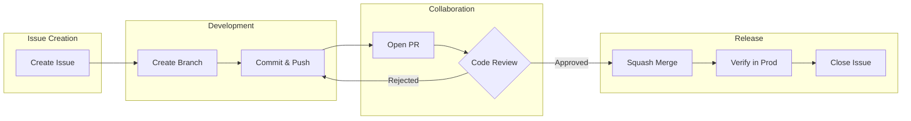

## Development

### Kanban board

**Link to the board**: [Kanban board](https://github.com/orgs/The-Ultimate-RAG/projects/3/views/2)

#### Column Entry Criteria

##### 1. **To Do**

- [x] Issue is created using the project’s issue templates.
- [x] Issue is **estimated** (story points) by the Team.
- [x] Issue is **prioritized** by the Team.
- [x] Issue is **assigned**.

##### 2. **In Progress**

- [x] **Merge Request (MR)** is created and linked to the issue.
- [x] **Reviewer(s)** are assigned.
- [x] Code passes **automated checks** (unit&integration testing, linting).

##### 4. **Ready to Deploy**

- [x] MR is **approved** by at least one reviewer.
- [x] All **review comments** are resolved.
- [x] Code is **merged** into target branch (`main`).

##### 5. **User Testing** *(Optional)*

- [x] Feature is deployed to **testing** server.
- [x] Testers/stakeholders are **notified**

#### 6. **Done**

- [x] Feature is deployed to **production** server.
- [x] User testing (if needed) is **approved**.
- [x] Issue is **closed**.

### Git Workflow

#### Base Workflow

We have developed our **custom** workflow due to CI/CD integration issues and features of the development process. Key
principles:

- `main` is always deployable.
- Feature branches are created from `main` and merged back via Pull Requests (PRs).
- No long-lived branches except `for_testing`, which serves for deploy to the testing server.

---

#### Rules

##### **1. Issues**

- Use the one of the Issue Templates.
- Include: **Description**, **Labels**, and **Milestone**.
- Assign the most logically suitable *label* from the list
  of [labels](https://github.com/The-Ultimate-RAG/The-Ultimate-RAG/issues/labels) (read their description first).
- Assign the issue to yourself, and contact [PM](https://github.com/PopovDanil) to re-assign if needed.

##### **2. Branching**

- For developing new feature create a new branch.
- There are now strict rules for naming, but each name should logically depict the changes on code (e.g. add response
  streaming &rarr; response_stream).
- For each merge mention the reason why branches were merged.

##### **3. Commit Messages**

- Template: `<type>(<scope>): <description>`.
- Examples:

```
feat(auth): add login button
fix(api): resolve null pointer in user endpoint
```

##### **4. Pull Requests (PRs) and Reviews**

- Use the [PR Template](/.github/PULL_REQUEST_TEMPLATE/standart.md).
- Target branch - `main`, but for testing `for_testing` can be used.
- Contact [PM](https://github.com/PopovDanil) to assign Reviewers.
- Merge pull request if the code passes **review**, **tests** and **linter** (in other case you will be unable to do
  it).
- Delete branch after merge.

##### **5. Resolving Issues**

- Close manually only after:
    - [x] PR is merged.
    - [x] Feature is verified in production (if applicable).

#### **Basic workflow example**



---

### Secrets management

Contact [DevOps lead](https://github.com/Andrchest) for more information.
All the secrets are stored in `.env` file. Its content will be provided after request to DevOps lead.