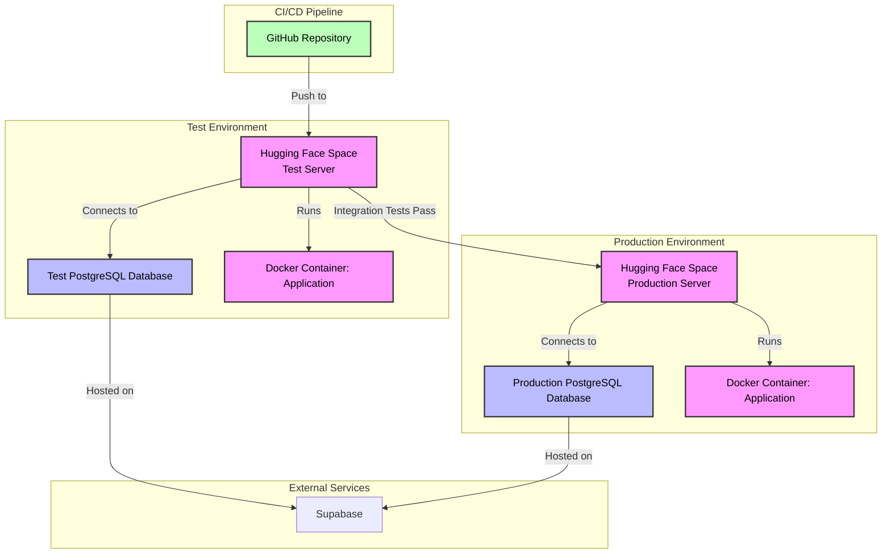

# The-Ultimate-RAG

## Overview

[S25] The Ultimate RAG is an Innopolis University software project that generates cited responses from a local database.

## Prerequisites

Before you begin, ensure the following is installed on your machine:

- [Python](https://www.python.org/)
- [Docker](https://www.docker.com/get-started/)

## Installation

1. **Clone the repository**
    ```bash
   git clone https://github.com/PopovDanil/The-Ultimate-RAG
   cd The-Ultimate-RAG
   ```
2. **Set up a virtual environment (recommended)**

   To isolate project dependencies and avoid conflicts, create a virtual environment:
    - **On Unix/Linux/macOS:**
   ```bash
   python3 -m venv env
   source env/bin/activate
   ```
    - **On Windows:**
    ```bash
    python -m venv env
    env\Scripts\activate
    ```
3. **Install required libraries**

   Within the activated virtual environment, install the dependencies:
   ```bash
   pip install -r ./app/requirements.txt
   ```
   *Note:* ensure you are in the virtual environment before running the command

4. **Set up Docker**
    - Ensure Docker is running on your machine
    - Open a terminal, navigate to project directory, and run:
    ```bash
    docker-compose up --build
    ```
   *Note:* The initial build may take 10–20 minutes, as it needs to download large language models and other
   dependencies.
   Later launches will be much faster.

5. **Server access**

   Once the containers are running, visit `http://localhost:5050`. You should see the application’s welcome page

To stop the application and shut down all containers, press `Ctrl+C` in the terminal where `docker-compose` is running,
and then run:

```bash
   docker-compose down
```

## Usage

You can try currently deployed version of the system [here](https://huggingface.co/spaces/The-Ultimate-RAG-HF/The-Ultimate-RAG). **Note**: you should use the following instructions:
- Access the cite, you should see the *main* page with the name of the system
- Press the button "+ Add new chat", wait until the *login* page is loaded
- Find button "Register" (for now it is highly recommended to follow the instructions *strictly*) and press it
- You should be redirected to *sing up* page, here you should enter your credentials (you can use Test1@test1.com in all field for testing)
- Click **ONLY ONCE** on the button "Sign Up", and wait (for now it takes around 10 seconds to load *chat* page)
- Now you will be able to communicate with the system
- You can try to ask any thing and attach files. Enter a query and press the *enter* button (near the input area)

## Architecture

### Static view

The following **diagram** depicts the current state of our codebase organization.


We have decided to adapt this architecture to enhance the *maintainability* of the product for the following reasons:
- [x] A **modular** system, which is reflected by the use of subsystems in our code increases the **reusability** of the components.
- [x] Individual subsystems can be easily **analyzed** in conjunction with monolith products.
- [x] This approach ensures the ease and speed of **testing**.
- [x] Additionally, each part can be **easily modified** without affecting the rest of the codebase.

### Dynamic view

The following **diagram** depicts the one non-trivial case of the system use: user queries the system and attach file. This diagram can halp in understating the pipeline of file processing and response generation:


### Deployment view

The deployment architecture of The Ultimate RAG is designed to ensure reliable, scalable, and isolated environments for testing and production.



- **Diagram Location:** The deployment diagram is stored at [`docs/architecture/deployment-view/deployment.mmd`](/docs/architecture/deployment-view/deployment.md).

**Deployment Choices:**
- **Hugging Face Spaces:** We use Hugging Face Spaces for both test and production environments due to their ease of use, free tier, and seamless integration with Git-based deployment. This allows rapid deployment and automatic scaling for our Python application.
- **Docker:** The application is containerized using Docker (defined in `docker-compose.yml`) to ensure consistency across test and production environments, simplifying dependency management and deployment.
- **Separate PostgreSQL Service:** The test and production PostgreSQL databases are hosted on an external service (not Hugging Face) to provide scalability, isolation, and robust database management. This ensures that test data does not interfere with production data.
- **Isolation of Environments:** Separate Hugging Face Spaces and databases for test and production prevent test activities from affecting the live application, ensuring stability for end users.

**Customer Deployment:**
Customers can access the application directly via the production Hugging Face Space at [URL to be provided]. No local deployment is required, as the application is hosted and managed on Hugging Face. To interact with the application, customers need:
- A web browser to access the production URL.
- Optional: API keys or credentials (contact the [DevOps lead](https://github.com/Andrchest) for access details, if applicable).
If customers prefer to deploy the application locally, they can follow the [Installation](#installation) instructions in this README, which include cloning the repository, setting up Docker, and configuring a `.env` file with a PostgreSQL connection string (contact the [DevOps lead](https://github.com/Andrchest) for details).

## Development

### Kanban board
**Link to the board**: [Kanban board](https://github.com/orgs/The-Ultimate-RAG/projects/3/views/2)

#### Column Entry Criteria

##### 1. **To Do**
- [x] Issue is created using the project’s issue templates.
- [x] Issue is **estimated** (story points) by the Team.
- [x] Issue is **prioritized** by the Team.
- [x] Issue is **assigned**.

##### 2. **In Progress**
- [x] **Merge Request (MR)** is created and linked to the issue.
- [x] **Reviewer(s)** are assigned.
- [x] Code passes **automated checks** (unit&integration testing, linting).

##### 4. **Ready to Deploy**
- [x] MR is **approved** by at least one reviewer.
- [x] All **review comments** are resolved.
- [x] Code is **merged** into target branch (`main`).

##### 5. **User Testing** *(Optional)*
- [x] Feature is deployed to **testing** server.
- [x] Testers/stakeholders are **notified**

#### 6. **Done**
- [x] Feature is deployed to **production** server.
- [x] User testing (if needed) is **approved**.
- [x] Issue is **closed**.

### Git Workflow

#### Base Workflow
We have developed our **custom** workflow due to CI/CD integration issues and features of the development process. Key principles:
- `main` is always deployable.
- Feature branches are created from `main` and merged back via Pull Requests (PRs).
- No long-lived branches except `for_testing`, which serves for deploy to the testing server.

---

#### Rules

##### **1. Issues**
- Use the one of the Issue Templates.
- Include: **Description**, **Labels**, and **Milestone**.
- Assign the most logically suitable *label* from the list of [labels](https://github.com/The-Ultimate-RAG/The-Ultimate-RAG/issues/labels) (read their description first).
- Assign the issue to yourself, and contact [PM](https://github.com/PopovDanil) to re-assign if needed.

##### **2. Branching**
- For developing new feature create a new branch.
- There are now strict rules for naming, but each name should logically depict the changes on code (e.g. add response streaming &rarr; response_stream).
- For each merge mention the reason why branches were merged.

##### **3. Commit Messages**
- Template: `<type>(<scope>): <description>`.
- Examples:
```
feat(auth): add login button
fix(api): resolve null pointer in user endpoint
```

##### **4. Pull Requests (PRs) and Reviews**
- Use the [PR Template](/.github/PULL_REQUEST_TEMPLATE/standart.md).
- Target branch - `main`, but for testing `for_testing` can be used.
- Contact [PM](https://github.com/PopovDanil) to assign Reviewers.
- Merge pull request if the code passes **review**, **tests** and **linter** (in other case you will be unable to do it).
- Delete branch after merge.

##### **5. Resolving Issues**
- Close manually only after:
   - [x] PR is merged.
   - [x] Feature is verified in production (if applicable).


#### **Basic workflow example**


---

### Secrets management
Contact [DevOps lead](https://github.com/Andrchest) for more information.
All the secrets are stored in `.env` file. Its content will be provided after request to DevOps lead.

## Quality assurance

### Quality attribute scenarios
You can find scenarios in the [docs/quality-assurance/quality-attribute-scenarios.md](./docs/quality-assurance/quality-attribute-scenarios.md)

### Automated tests
We've implemented a comprehensive automated testing suite using the following tools:
- 🐍 [pytest](https://docs.pytest.org/) - Primary test runner and framework
- ⚡ [httpx](https://www.python-httpx.org/) - Async HTTP client for API testing

| Test Type          | Location                      | Description                                                                 | Tools Used          |
|--------------------|-------------------------------|-----------------------------------------------------------------------------|---------------------|
| Unit Tests         | `app/tests/unit/`             | Tests for individual components and utility functions                       | pytest              |
| Integration Tests  | `app/tests/integration/`      | Tests for component interactions and, API and RAG systems integrations      | pytest + httpx      |
| Performance Tests  | `app/tests/performance/`      | *Will be added soon.* Will collect the statistical information of time, speed, and correctness evaluations  | pytest + httpx      |


### User acceptance tests
See [acceptance test](./docs/quality-assurance/user-acceptance-tests.md) for the formal definition of system readiness.

## Build and deployment

### Continuous Integration

Our Continuous Integration (CI) pipeline ensures code quality by running automated checks on every pull request to the `main` branch. The pipeline is managed using GitHub Actions and is defined in:

- [`.github/workflows/unit-tests.yml`](https://github.com/The-Ultimate-RAG/The-Ultimate-RAG/blob/main/.github/workflows/unit-tests.yml)

In the CI pipeline, we use the following tools:

- **Static Analysis Tools:**
  - **flake8**: A linter for Python that enforces coding style and detects programming errors.
  - **bandit**: A security vulnerability scanner for Python, identifying potential security issues in the codebase.

- **Testing Tools:**
  - **pytest**: A testing framework for Python, used to run unit tests located in [`app/tests/unit`](https://github.com/The-Ultimate-RAG/The-Ultimate-RAG/tree/main/app/tests/unit).

If any checks fail, the pull request cannot be merged into `main`. All CI workflow runs can be viewed at:

- [GitHub Actions - CI Workflow Runs](https://github.com/The-Ultimate-RAG/The-Ultimate-RAG/actions/workflows/unit-tests.yml)

### Continuous Deployment

Our Continuous Deployment (CD) pipeline automatically deploys the application after a successful merge into `main`. The pipeline is defined in:

- [`.github/workflows/sync-to-hf.yml`](https://github.com/The-Ultimate-RAG/The-Ultimate-RAG/blob/main/.github/workflows/sync-to-hf.yml)

The CD pipeline performs the following steps:
1. Pushes the updated code to a **Hugging Face Space** (test environment) using `git`, where it is automatically deployed.
2. Runs **integration tests** on the test server with a test PostgreSQL database (hosted on a separate service), using tests located in [`app/tests/integration`](https://github.com/The-Ultimate-RAG/The-Ultimate-RAG/tree/main/app/tests/integration).
3. If integration tests pass, deploys to a separate **Hugging Face Space** (production environment) with a production PostgreSQL database (also hosted on a separate service). Deployment takes approximately 2–3 minutes.
4. If any tests fail, the production server remains unaffected.

In the CD pipeline, we use the following tools:

- **Deployment Tools:**
  - **Docker**: Builds and packages the application as a container.
  - **git**: Pushes the application to Hugging Face Spaces for deployment.
- **Testing Tools:**
  - **pytest**: Runs integration tests on the test server.

All CD workflow runs can be viewed at:

- [GitHub Actions - CD Workflow Runs](https://github.com/The-Ultimate-RAG/The-Ultimate-RAG/actions/workflows/sync-to-hf.yml)

## License

This project is licensed under the [MIT License](LICENSE).