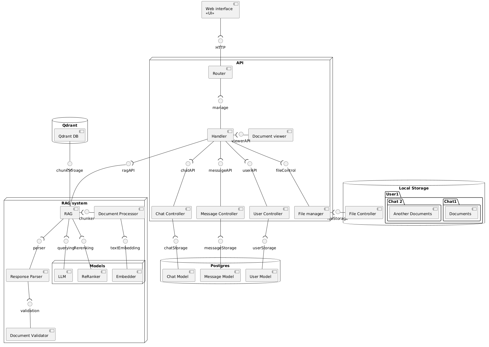
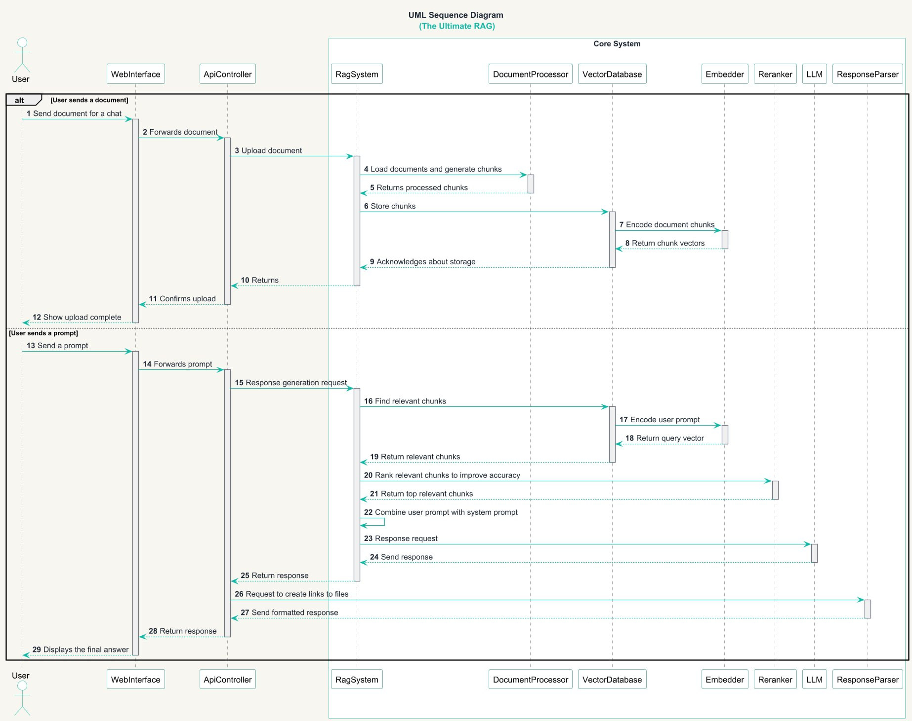
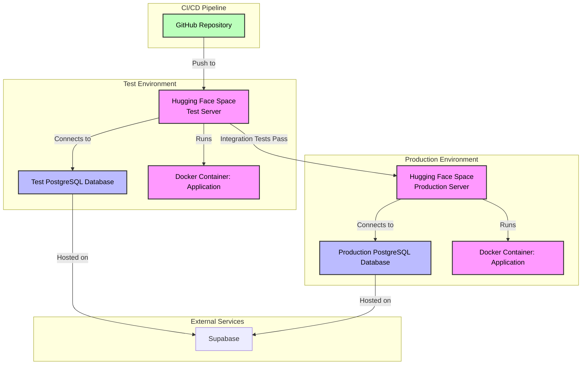

## Architecture

### Static view

The following **diagram** depicts the current state of our codebase organization.

We have decided to adapt this architecture to enhance the *maintainability* of the product for the following reasons:

- [x] A **modular** system, which is reflected by the use of subsystems in our code increases the **reusability** of the
  components.
- [x] Individual subsystems can be easily **analyzed** in conjunction with monolith products.
- [x] This approach ensures the ease and speed of **testing**.
- [x] Additionally, each part can be **easily modified** without affecting the rest of the codebase.

### Dynamic view

The following **diagram** depicts the one non-trivial case of the system use: user queries the system and attach file.
This diagram can halp in understating the pipeline of file processing and response generation:

### Deployment view

The deployment architecture of The Ultimate RAG is designed to ensure reliable, scalable, and isolated environments for
testing and production.

- **Diagram Location:** The deployment diagram is stored at [
  `docs/architecture/deployment-view/deployment.mmd`](/docs/architecture/deployment-view/deployment.md).

**Deployment Choices:**

- **Hugging Face Spaces:** We use Hugging Face Spaces for both test and production environments due to their ease of
  use, free tier, and seamless integration with Git-based deployment. This allows rapid deployment and automatic scaling
  for our Python application.
- **Docker:** The application is containerized using Docker (defined in `docker-compose.yml`) to ensure consistency
  across test and production environments, simplifying dependency management and deployment.
- **Separate PostgreSQL Service:** The test and production PostgreSQL databases are hosted on an external service (not
  Hugging Face) to provide scalability, isolation, and robust database management. This ensures that test data does not
  interfere with production data.
- **Isolation of Environments:** Separate Hugging Face Spaces and databases for test and production prevent test
  activities from affecting the live application, ensuring stability for end users.

**Customer Deployment:**
Customers can access the application directly via the production Hugging Face Space at [URL to be provided]. No local
deployment is required, as the application is hosted and managed on Hugging Face. To interact with the application,
customers need:

- A web browser to access the production URL.
- Optional: API keys or credentials (contact the [DevOps lead](https://github.com/Andrchest) for access details, if
  applicable).
  If customers prefer to deploy the application locally, they can follow the [Installation](#installation) instructions
  in this README, which include cloning the repository, setting up Docker, and configuring a `.env` file with a
  PostgreSQL connection string (contact the [DevOps lead](https://github.com/Andrchest) for details).

### Tech stack 
- Python
- FastAPI
- Docker
- Qdrant
- TypeScript
- React