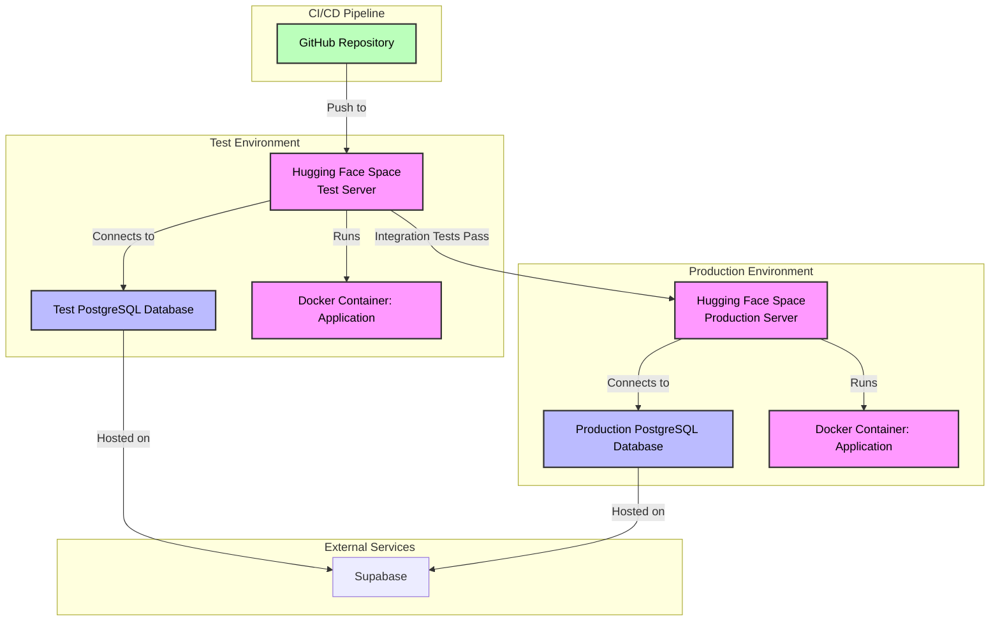

```mermaid
graph TD
    subgraph Test Environment
        TEST_SPACE[Hugging Face Space <br> Test Server] -->|Connects to| TEST_DB[Test PostgreSQL Database]
        TEST_SPACE -->|Runs| APP_TEST[Docker Container: Application]
    end

    subgraph Production Environment
        PROD_SPACE[Hugging Face Space <br> Production Server] -->|Connects to| PROD_DB[Production PostgreSQL Database]
        PROD_SPACE -->|Runs| APP_PROD[Docker Container: Application]
    end

    subgraph CI/CD Pipeline
        GITHUB[GitHub Repository] -->|Push to| TEST_SPACE
        TEST_SPACE -->|Integration Tests Pass| PROD_SPACE
    end

    subgraph External Services
        TEST_DB -->|Hosted on| DB_SERVICE[Supabase]
        PROD_DB -->|Hosted on| DB_SERVICE
    end

    classDef server fill:#f9f,stroke:#333,stroke-width:2px,color:#000000;
    classDef db fill:#bbf,stroke:#333,stroke-width:2px,color:#000000;
    classDef pipeline fill:#bfb,stroke:#333,stroke-width:2px,color:#000000;
    class TEST_SPACE,PROD_SPACE,APP_TEST,APP_PROD server;
    class TEST_DB,PROD_DB db;
    class GITHUB pipeline;
```